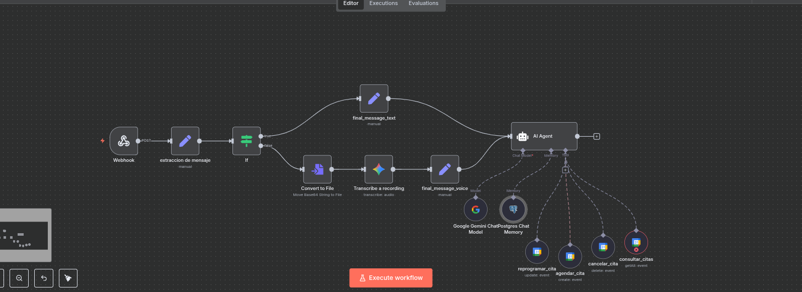

# 🤖 Asistente de Calendario con n8n y Evolution API

Este proyecto despliega un entorno automatizado que conecta **Evolution API** (una API no oficial para WhatsApp) con **n8n** para crear eventos en **Google Calendar**.

Es una solución poderosa y auto-hospedada para convertir mensajes de WhatsApp (texto y audio) en eventos de calendario de forma automática, ideal para agendar citas, recordatorios o tareas directamente desde tus conversaciones.

---

## ✨ Características Principales

-   **Entorno Contenerizado:** Todo listo para desplegar con un solo comando gracias a Docker Compose.
-   **Componentes Incluidos:**
    -   🟢 **Evolution API:** Para recibir y enviar mensajes de WhatsApp.
    -   ⚙️ **n8n:** El motor de automatización que conecta los servicios.
    -   🐘 **PostgreSQL:** Base de datos persistente para n8n y la memoria del chat.
    -   ⚡ **Redis:** Para optimizar el rendimiento de n8n.
-   **Automatización Inteligente:** Usa un Agente de IA para entender peticiones y gestionar el calendario.
-   **Soporte Multimodal:** Capaz de procesar mensajes de texto y notas de voz.
-   **Escalable y Personalizable:** Puedes modificar fácilmente los flujos de n8n para añadir más lógica o integraciones.

---

## 📋 Prerrequisitos

-   [**Docker**](https://docs.docker.com/get-docker/)
-   [**Docker Compose**](https://docs.docker.com/compose/install/)
-   [**Ngrok**](https://ngrok.com/download) (Recomendado para entornos locales)

---

## 🚀 Guía de Inicio Rápido

1.  **Clona el repositorio:**
    ```bash
    git clone <URL_DEL_REPOSITORIO>
    cd nombre-del-directorio
    ```

2.  **Configura las variables de entorno:**
    Crea un archivo `.env` a partir del ejemplo proporcionado (`cp .env.example .env`) y ajusta las variables según tus necesidades.

3.  **Levanta los servicios:**
    ```bash
    docker compose up -d
    ```

4.  **Expón tu n8n a Internet con ngrok (Muy recomendado):**
    Para que servicios como Google y Evolution API puedan enviar datos a tu n8n local, necesitas una URL pública. `ngrok` es la herramienta perfecta para esto.
    
    Abre una nueva terminal y ejecuta:
    ```bash
    ngrok http 5678
    ```
    `ngrok` te dará una URL pública (ej. `https://xxxx-xxxx.ngrok-free.app`). **Usa esta URL pública en lugar de `localhost:5678`** para los siguientes pasos.

5.  **Accede a las aplicaciones:**
    -   **n8n:** `http://localhost:5678` (o tu URL de ngrok)
    -   **Evolution API:** `http://localhost:8080`

---

## 🛠️ Configuración Post-Instalación

1.  **En n8n:**
    -   Importa el flujo de trabajo (`workflow.json`) proporcionado en este repositorio.
    -   Configura las credenciales necesarias (Google, Gemini, PostgreSQL). **Importante:** Cuando configures las credenciales de Google OAuth, asegúrate de usar tu **URL de ngrok** en la lista de URIs de redireccionamiento autorizadas en la Consola de Google Cloud.

2.  **En Evolution API:**
    -   Crea tu instancia de WhatsApp.
    -   Copia la URL del **Webhook de Producción** del nodo `Webhook` en n8n. Asegúrate de que sea la **URL proporcionada por ngrok**.
    -   Configura esa URL en tu instancia de Evolution API para que notifique a n8n cada vez que llegue un mensaje.

---

## 🔎 Análisis del Flujo de Trabajo (Workflow)

El corazón de este proyecto es el flujo de n8n. A continuación se detalla la función de cada nodo clave.



### 1. Webhook
-   **Propósito:** Es el punto de entrada. Recibe los datos enviados por Evolution API.
-   **Configuración:** La `Production URL` es la que debes pegar en la configuración de webhooks de Evolution API (preferiblemente la de ngrok).

### 2. Bifurcación (Nodo `If`)
-   **Propósito:** Revisa si el mensaje entrante contiene texto o una nota de voz (`voice_message`) y dirige el flujo.

### 3. Ruta de Audio y Texto
-   Si es audio, se convierte el `Base64` a un archivo `audio/ogg`, se transcribe a texto y se prepara para el agente.
-   Si es texto, se prepara directamente para el agente.

### 4. 🤖 AI Agent (El Cerebro)
Este es el nodo central que orquesta todo.

-   **Chat Model (`Google Gemini Chat Model`):**
    -   **Propósito:** Es el modelo de lenguaje que entiende las peticiones del usuario.
    -   **Credenciales:** Sigue los pasos de la sección **"Integración con IA"** para obtener tu clave API de Gemini.
    -   **Modelo:** Se recomienda usar `gemini-1.5-pro` o superior para poder analizar audios.

-   **Chat Memory (`Postgres Chat Memory`):**
    -   **Propósito:** Permite al agente recordar el contexto de la conversación (los últimos 10 mensajes).
    -   **Credenciales:**
        -   **¡IMPORTANTE!** Para crear el usuario y la base de datos que n8n necesita para esta credencial, **abre y ejecuta los comandos que se encuentran en el archivo `evolution_postgres.txt`** incluido en el repositorio. Este archivo te guiará para conectarte al contenedor de la base de datos y configurar el usuario correctamente.
        -   Una vez creado, usa los valores (`usuario`, `contraseña`, `host`, `base de datos`) que definiste. El `host` debe ser el nombre del servicio de Docker (ej. `postgres`).

-   **Herramientas (Tools - Nodos de Google Calendar):**
    Son las acciones que el agente puede ejecutar. Cada herramienta tiene una descripción en lenguaje natural que ayuda a la IA a decidir cuál usar.
    -   `agendar_cita`: Crea un nuevo evento.
    -   `reprogramar_cita`: Actualiza un evento existente.
    -   `cancelar_cita`: Elimina un evento.
    -   `consultar_citas`: Busca y devuelve eventos futuros.

---

## 🧠 Integración con IA (Recomendación: Google Gemini)

Para que el bot funcione, necesitas una API de Inteligencia Artificial. **Se recomienda encarecidamente el uso de Google Gemini**.

-   **✅ Nivel Gratuito Generoso:** Ofrece un amplio límite de uso sin costo.
-   **🔊 Capacidades Multimodales:** Las versiones más recientes pueden procesar tanto texto como audio.

### Puntos Clave:

1.  **Versión del Modelo:** Utiliza **Gemini 1.5 Pro** o superior. Es la versión que puede **analizar audios** de WhatsApp.
2.  **Consumo de Tokens:** El nivel gratuito tiene un límite. Ten en cuenta que **el análisis de audio consume significativamente más tokens** que el texto.

---

## ⚙️ Gestión del Entorno

-   **Para detener todos los servicios:**
    ```bash
    docker compose down
    ```
-   **Para detener y eliminar los volúmenes** (¡cuidado, esto borrará tus flujos y credenciales de n8n!):
    ```bash
    docker compose down -v
    ```
